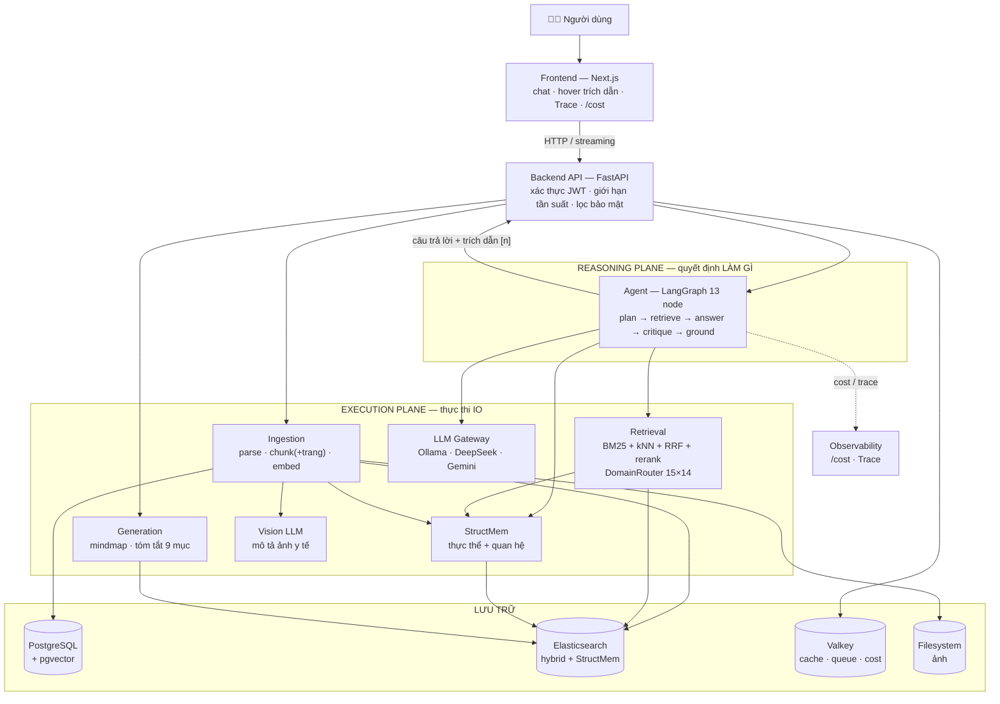
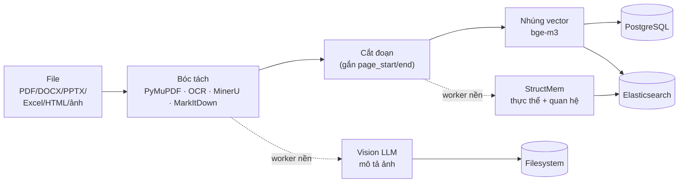
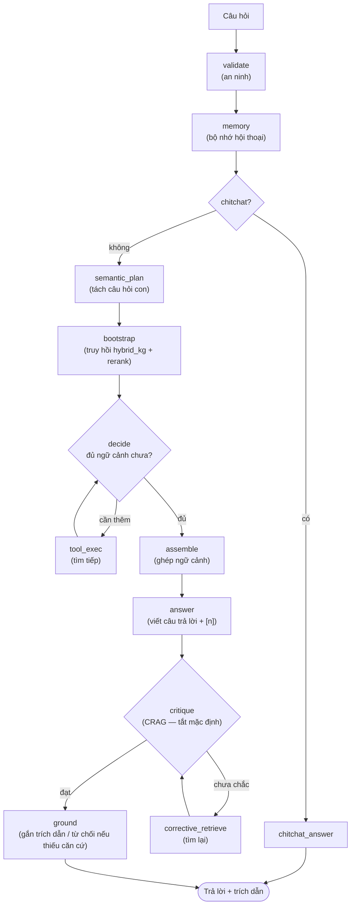

# Sơ đồ kiến trúc VITAL (Mermaid)

> Dán trực tiếp vào báo cáo `.md` (GitHub/VSCode render tự động), hoặc export PNG/SVG để chèn vào
> docx/slide. Cách render & export ở cuối file.

---

## Hình 1 — Kiến trúc tổng thể



---

## Hình 2 — Luồng nạp tài liệu (offline, một lần khi upload)



---

## Hình 3 — Luồng trả lời câu hỏi (Agent 13 node)



---

## Cách render & export

**Xem nhanh / sửa:**
- Web: dán vào https://mermaid.live → sửa trực quan, bấm **Export PNG/SVG**.
- VSCode: cài extension *"Markdown Preview Mermaid Support"* → mở preview (Ctrl+Shift+V).
- GitHub: tự render khi xem file `.md` trong repo.

**Export ra ảnh để chèn docx/slide (dòng lệnh):**
```bash
# cài 1 lần
npm i -g @mermaid-js/mermaid-cli
# tách từng hình ra file .mmd rồi:
mmdc -i hinh1.mmd -o hinh1.svg     # SVG: nét sắc, phóng to không vỡ (khuyên dùng)
mmdc -i hinh1.mmd -o hinh1.png -s 3   # PNG độ phân giải cao (scale 3x)
```

**Nếu muốn hình "đẹp tay" hơn** (báo cáo in / bảo vệ): vẽ lại bằng **Excalidraw**
(excalidraw.com — phong cách phác thảo) hoặc **draw.io** (app.diagrams.net) — GUI kéo–thả, export
PNG/SVG. Đánh đổi: không sửa bằng text, khó version-control như Mermaid.
